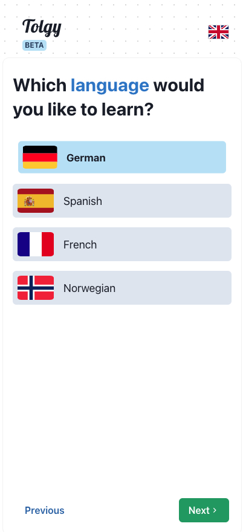
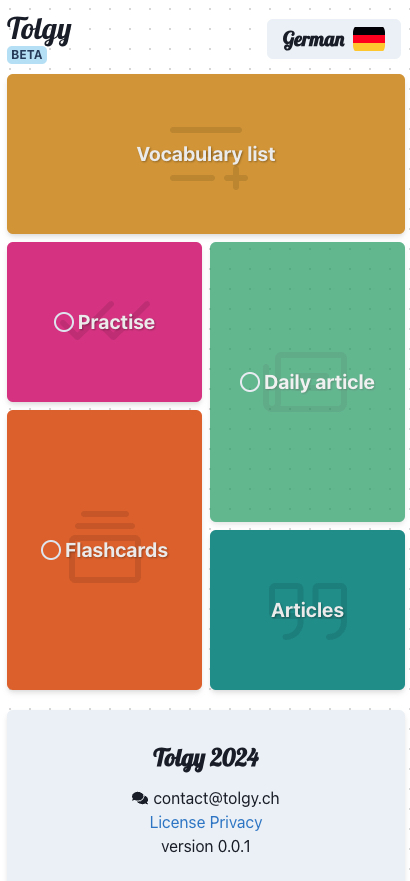

# Tolgy - customized way to learn languages

Repository constains public build of Tolgy application. At this moment only Android is supported, iOS will be added later

More information about application: [http://tolgy.ch]()

## Few screen from application

Example step in oboarding process:

Application dashboard:

Details of flashcard:

